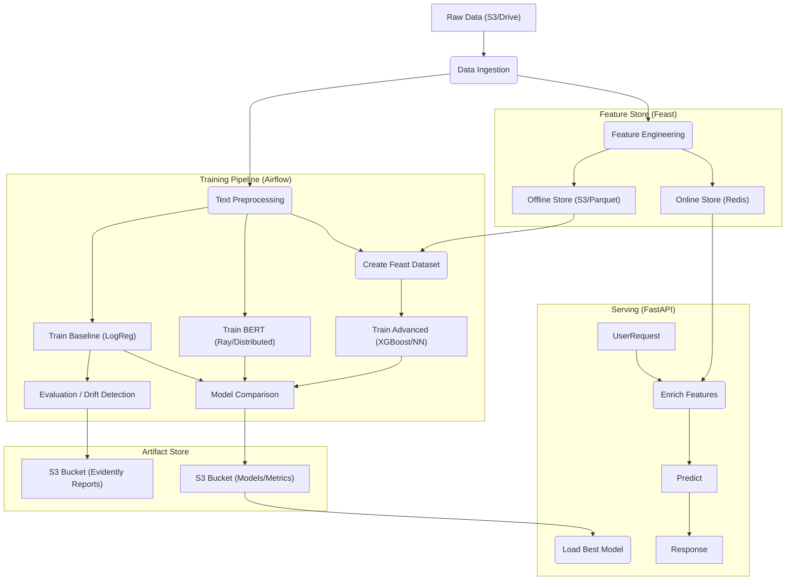

# IMDB Spoiler Shield 🛡️🎬

A production-grade MLOps system to detect spoilers in movie reviews. This project demonstrates a complete end-to-end machine learning lifecycle, from data ingestion and feature engineering to distributed training and real-time serving, built on a robust cloud-native stack.

## 🏗️ Architecture

The system is designed to be modular, scalable, and cloud-agnostic (optimized for AWS EC2 & S3).



### 🚀 Key Components

*   **Orchestration:** **Apache Airflow** manages the DAG execution, ensuring dependencies between ingestion, feature engineering, and model training are respected.
*   **Feature Store:** **Feast** manages features (`duration`, `rating`, `sentiment`) consistency.
    *   *Offline:* Parquet files on S3 for training point-in-time joins.
    *   *Online:* Redis for low-latency retrieval during inference.
*   **Experiment Tracking:** **MLflow** logs parameters, metrics, and artifacts for every training run.
*   **Distributed Training:** **Ray Train & Ray Tune** enable scaling BERT and DistilBERT fine-tuning across multiple GPUs (EC2 A100s) or local accelerators (Mac Metal/MPS).
*   **Monitoring:** **Evidently AI** detects data drift and model performance degradation.
*   **Storage:** **AWS S3** acts as the central data lake and artifact repository.
*   **Serving:** **FastAPI** provides a high-performance REST API for real-time predictions.

---

## 🧠 Models

We employ a multi-tier modeling strategy to balance speed and accuracy:

1.  **Baseline Model (Logistic Regression):**
    *   **Input:** TF-IDF vectors.
    *   **Optimization:** Class weights applied to handle the 75/25 imbalance.
    *   **Use Case:** Quick benchmarks and interpretability.

2.  **Advanced NLP (BERT-base & DistilBERT):**
    *   **Input:** Raw text (Tokenized).
    *   **Training:** Fine-tuned using **PyTorch** and **Ray**.
    *   **Strategy:** Trained on a stratified 30% subsample. Supports hardware acceleration on Mac (MPS) and EC2 (CUDA).

3.  **Hybrid Advanced Models (XGBoost & Neural Networks):**
    *   **Input:** Hybrid features combining **Sentence Embeddings** (SBERT) + **Feast Features** (Movie metadata).
    *   **Training:** Leverages Feast for point-in-time historical feature retrieval.

---

## 🏃‍♂️ Usage

### Running the Pipeline (Airflow)
1.  Access Airflow UI at `http://localhost:8080`.
2.  Trigger the `imdb_spoiler_pipeline` DAG.
3.  Watch the tasks execute:
    *   `create_feast_dataset`: Generates training data from the Feature Store.
    *   `train_bert_model`: Launches distributed training for both BERT and DistilBERT.
    *   `compare_models`: Evaluates all models (Baseline, Advanced, BERT) to select the winner.

### Inference API
The API loads the best model from S3 on startup and enriches requests with real-time features from Redis.

```bash
curl -X POST "http://localhost:8000/predict" \
     -H "Content-Type: application/json" \
     -d '{"movie_id": "tt0111161", "review_text": "Bruce Willis was a ghost the whole time!"}'
```
