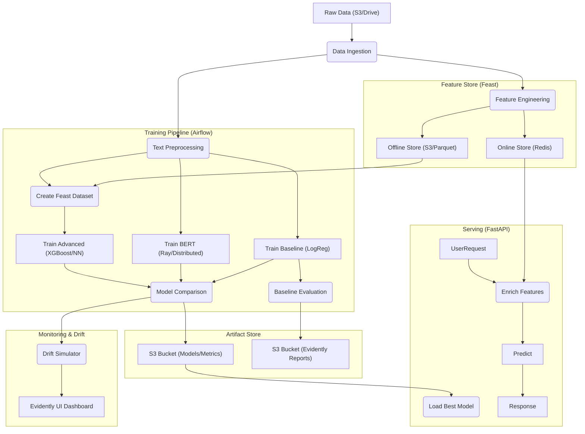

# IMDB Spoiler Shield 🛡️🎬

A production-grade MLOps system to detect spoilers in movie reviews. This project demonstrates a complete end-to-end machine learning lifecycle, from data ingestion and feature engineering to distributed training, real-time serving, and persistent monitoring.

## 🏗️ Architecture

The system is modular, scalable, and cloud-native (optimized for AWS EC2 & S3).



### 🚀 Key Components

*   **Orchestration:** **Apache Airflow** manages the DAG execution and task dependencies.
*   **Feature Store:** **Feast** ensures feature consistency across training and inference.
*   **Distributed Training:** **Ray Train & Tune** enable scaling BERT fine-tuning across multiple GPUs (EC2 A100s) or local accelerators (Mac MPS).
*   **Monitoring Dashboard:** **Evidently UI** provides a persistent interface to track data drift, quality, and concept drift over time.
*   **Drift Simulation:** A dedicated script simulates production failures (data quality issues and adversarial attacks) to test the monitoring stack.
*   **Serving:** **FastAPI** exposes a real-time prediction endpoint enriched by Feast.

---

## 🧠 Models

1.  **Baseline (Logistic Regression):** Fast, TF-IDF based, uses class weights for imbalance.
2.  **Advanced NLP (BERT & DistilBERT):** Context-aware, fine-tuned using PyTorch and Ray on 30% stratified data.
3.  **Hybrid Advanced (XGBoost & NN):** Combines SBERT Embeddings with Feast Metadata (Duration, Rating, etc.) for high-precision detection.

---

## 📊 Monitoring & Drift Simulation

Since production drift takes time to occur naturally, we provide a simulation tool to populate the Evidently dashboard.

### 1. Start the Dashboard
```bash
docker-compose up -d evidently-ui
# Visit: http://localhost:8001
```

### 2. Run Drift Simulation
The simulator generates three batches of data: **Normal**, **Data Quality Issues** (broken feature pipeline), and **Concept Drift** (adversarial spoiler attack).
```bash
python src/simulate_drift.py
```

---

## 🛠️ Setup & Installation

### 1. Environment Configuration
Create a `.env` file:
```bash
AIRFLOW_UID=502
S3_BUCKET=your-s3-bucket-name
AWS_ACCESS_KEY_ID=your_key
AWS_SECRET_ACCESS_KEY=your_secret
MLFLOW_TRACKING_URI=http://mlflow-server:5000
```

### 2. Deployment
```bash
# Start all services
docker-compose up -d --build
```

---

## 🏃‍♂️ Usage

### Airflow Pipeline
Access `http://localhost:8080` to run the `imdb_spoiler_pipeline` DAG. It automates:
*   Feature materialization.
*   Training data generation via Feast.
*   Parallel model training (Baseline vs BERT vs Hybrid).
*   Metric comparison and artifact promotion.

### Inference API
```bash
# Test Prediction
curl -X POST "http://localhost:8000/predict" \
     -H "Content-Type: application/json" \
     -d '{"movie_id": "tt0111161", "review_text": "He was a ghost the whole time!"}'
```

---

## 📂 Project Structure

```
├── app/                  # FastAPI serving layer
├── dags/                 # Airflow DAGs
├── feature_repo/         # Feast registry and definitions
├── src/                  # Core logic
│   ├── simulate_drift.py # Drift simulation tool
│   ├── train_bert.py     # Ray/Distributed BERT training
│   ├── train_advanced.py # Hybrid models (XGB/NN + Feast)
│   ├── ...
├── docker-compose.yml
└── README.md
```