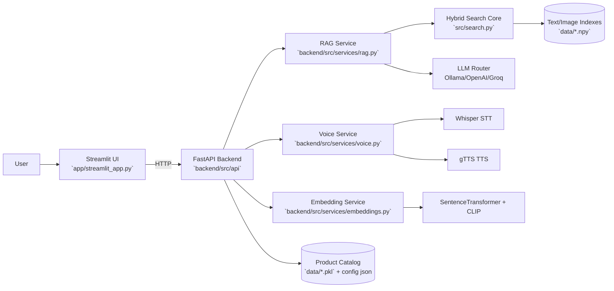
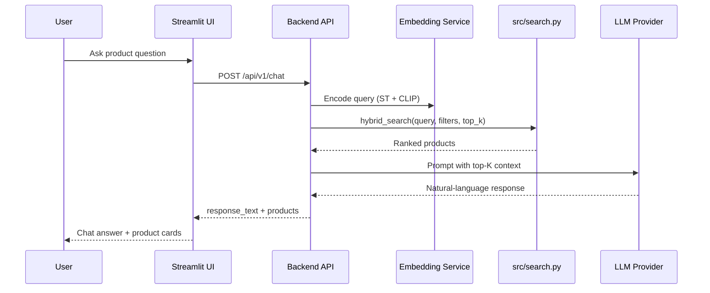

# ShopTalk Assistant

AI-powered shopping assistant with hybrid retrieval (text + image embeddings), RAG generation, and optional voice interaction.

This repository contains:
- Offline notebook pipeline (`notebooks/`) for data prep, enrichment, RAG evaluation, and fine-tuning.
- Production services for serving search + chat (`backend/`, `app/`, `frontend/`).
- Deployment scripts for local Docker and EC2 (`deploy/`).

## Architecture

## Text Query Sequence

## Repository Layout

- `notebooks/`: EDA, captioning, RAG integration, fine-tuning experiments.
- `src/`: shared retrieval/reranking logic used by notebooks and services.
- `backend/`: FastAPI API, RAG orchestration, model and voice services.
- `app/`: Streamlit UI (thin-client + standalone mode).
- `frontend/`: Docker image wrapper for Streamlit service.
- `deploy/`: EC2 setup and deploy automation scripts.
- `data/`: runtime artifacts exported from notebooks (not committed).

## Required Runtime Artifacts (`data/`)

At minimum:
- `rag_products.pkl` (or `products_with_prices.pkl`)
- `rag_text_index.npy` (or `finetuned_text_index.npy`)
- `rag_image_index.npy`
- `rag_config.json`

Optional fine-tuned encoder directory:
- `models/finetuned-shoptalk-emb/`

## Pre-Deploy Artifact Checklist

Use this checklist before running Docker/EC2 deploy:

| Status | Artifact | Required | Produced By | Used By |
|---|---|---|---|---|
| [ ] | `data/rag_products.pkl` or `data/products_with_prices.pkl` | Yes | `03-rag-prototype.ipynb` / `04-llm-integration.ipynb` | backend + app (standalone) |
| [ ] | `data/rag_text_index.npy` | Yes* | `03-rag-prototype.ipynb` | backend + app (fallback) |
| [ ] | `data/rag_image_index.npy` | Yes | `03-rag-prototype.ipynb` | backend + app |
| [ ] | `data/rag_config.json` | Yes | `03-rag-prototype.ipynb` | backend + app |
| [ ] | `data/finetuned_text_index.npy` | Recommended | `05-fine-tuning.ipynb` | backend + app (preferred text index) |
| [ ] | `data/models/finetuned-shoptalk-emb/` | Recommended | `05-fine-tuning.ipynb` | backend + app (preferred encoder) |
| [ ] | `data/eval_queries.json` | Optional | `04-llm-integration.ipynb` | eval workflows |
| [ ] | `data/llm_evaluation.csv` | Optional | `04-llm-integration.ipynb` | analysis/reporting |
| [ ] | `data/llm_comparison.csv` | Optional | `04-llm-integration.ipynb` | analysis/reporting |
| [ ] | `data/llm_config.json` | Optional | `04-llm-integration.ipynb` | config/audit |
| [ ] | `data/finetune_evaluation.csv` | Optional | `05-fine-tuning.ipynb` | analysis/reporting |

\* If `finetuned_text_index.npy` is present and used, base `rag_text_index.npy` can be treated as fallback.

## Quick Start (Docker Compose)

1. Put notebook outputs into `data/`.
2. Copy env template:
   - `cp .env.example .env`
3. Start all services:
   - `docker compose up -d --build`
4. Open:
   - Frontend: `http://localhost:8501`
   - Backend health: `http://localhost:8000/health`

CPU-only hosts:
- `docker compose -f docker-compose.yml -f docker-compose.cpu.yml up -d`

## Fine-Tuned Model Serving

The serving stack now supports an explicit fine-tuned SentenceTransformer path:
- Env var: `FINETUNED_MODEL_PATH`
- Default in compose/backend: `/app/data/models/finetuned-shoptalk-emb`

Resolution order:
1. `FINETUNED_MODEL_PATH` (if exists)
2. default fine-tuned folder under `data/models/`
3. fallback base model (`all-MiniLM-L6-v2`)

## Folder-Level Docs

- `backend/README.md`
- `app/README.md`
- `frontend/README.md`
- `deploy/README.md`
- `src/README.md`
- `notebooks/README.md`
- `data/README.md`
